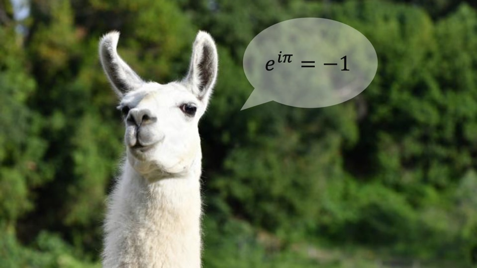
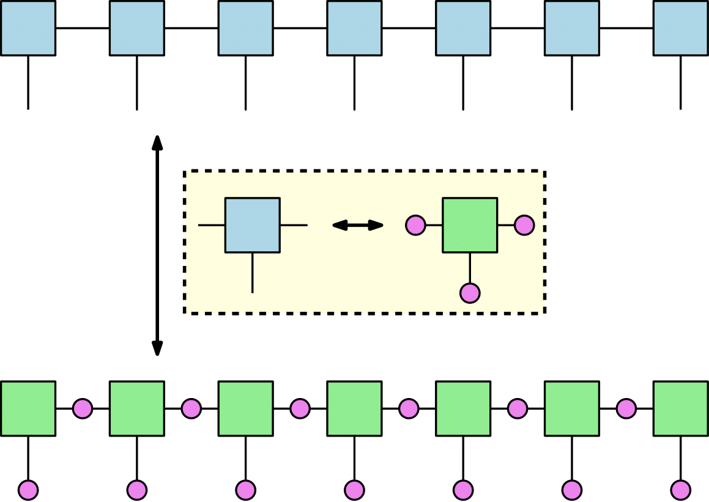
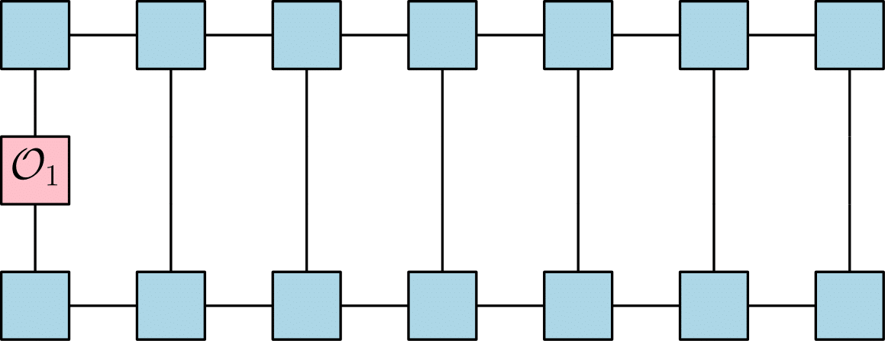
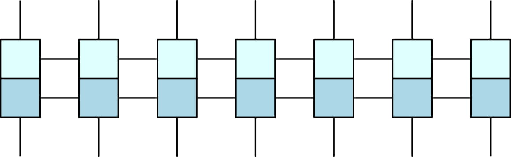

# Welcome

So, why llama you ask?
well, I'm not really sure, I think that llamas are the new unicorns and unicorns are obviously cool
so this thing is actually writing itself as you can see.

---

[Tensor Networks and Probabilistic Graphical Models Duality](#tensor-networks-and-probabilistic-graphical-models-duality) 

# Tensor Networks and Probabilistic Graphical Models Duality

In the [papper](https://arxiv.org/abs/1710.01437) of Elina Robeva (MIT) and Anna Seigal (Berkeley) "*Duality of Graphical Models and Tensor Networks*", following proposition (3.7) which states that marginalization in graphical models and contractions in tensor networks (TN) are actually the same thing and can be described using the next equation

where we get the marginal on the distribution over the  veriables as a sum of all other veriables (or tensor entries in TN description) over the product of all tensors in the tensor network.

All the work done in the papper above is in the context of Markov Random Fields (MRF) graphical models, and what I would like to do next is to workout the duality notion between TN and [Factor Graphs](https://en.wikipedia.org/wiki/Factor_graph) (FG) which is another form of graphical models and between TN and Double-Edge Normal Factor Graphs (DEnFG) which is a form of a Normal Factor Graph. Let's work out the [MPS](https://en.wikipedia.org/wiki/Matrix_product_state) TN although the conclusions would be true for any general TN.
 

In the figure above it is possible to see how the MPS TN transforms to a FG under the duality, where every edge (bond) in the TN become a node (pink circle) with alphabet size same as the edge (bond) dimension. The  marginalization over the FG probability distribution is given by

where every factor is identical to its dual tensor  such that , so contraction and marginalization are the same also here. The only difference in the FG case is that the tansors and factors are identical where in the MRF case the edges of the TN become nodes and the tensors become *hyperedges*.

## How can we utilize the duality for computations
### TN Contraction
In general, given a TN, a common operation would be to calculate the expectation value of some local observable i.e the local operator  which is operating over the  spin. In the 7 spins MPS TN case, the local observeble expectation over the first spin would look like that

To compute the expectation above one would need to contract the whole network. If for example the network maximal bond dimension is  and the spins dimension is  the contraction time would be  where in the case above .

### Loopy Belief Propagation ([LBP](https://en.wikipedia.org/wiki/Belief_propagation))
Another way to calculate this expectation is to transform the TN to a FG and then implement LBP which is a message-passing algorithm used for inference. For each time step we would make a full update over all the messages from nodes to factros and vice versa. The messages (up to normalization factors) are given by 

where the 's are the node indices and the 's are the factor indices. In the case of tree FG there is a theorem by [Yedidia et al](http://www.merl.com/publications/docs/TR2001-22.pdf) which states that the Belief Propagation (no loops) messages converge to their *true value*. Later using the messages we can calculate the node and factor beliefs (marginals) via

If the FG has loops the LPB might not even converge and if it does there is no guarantee that the messages will converge to their true value. So, for loopy FG the beliefs are approximations to the true FG marginals. This is called the Bethe approximation which approximate the graph as if it was a tree. The quality of the approximation would depend on the number and size of loops in the graph.

If the LBP does converge, it would take  where  is the number of full update iterations,  is the number of spins,  is the maximal number of neighbors (for all factors) and  is the maximal node alphabet. 

All this is working very well in general, the problem arises when our tensors in the TN have complex entries. The complex value entries objective is to describe the phases in the mixed state wavefunction. In that case the product of all the factros in the graph would be a complex valued tensor so it can't be interpreted as a probability distribution. This means that we need to find other graphical model formalism which can support probability interpretation of complex tensors.

## Is there a way to go around the complex valued Tensors
If you recall, in quantum information theory the techniques to calculate an expectation value of an operator  given a wave function  is through 

where  is the density matrix. The density matrix is a [psd matrix](https://en.wikipedia.org/wiki/Definiteness_of_a_matrix#Definitions_for_complex_matrices) whixh means its eigenvalues are all larger or equal to zero. The purpose of all this is to show that the usage of density matrices instead of wavefunctions is much more efficient in the graphical models world. Although in the TN world it actually does not matter, i.e the MPS density matrix would look like

where I put deferent colors just to illustrate batter the complex conjugate of the wavefunction TN which is in the upper side of the figure. Now, calculating the expectation of a local observable  would mean to contract the same network as in the figure above of MPS expectation. On the other hand, we could use the [DEnFG](##Double-Edge-normal-Factor-Graphs) formalism to calculate the same expectation (even for complex tensors) in the graphical models world.

## Double-Edge normal Factor Graphs (DEnFG)
The first time I was encountered with DEnFG was in the [papper](https://ieeexplore.ieee.org/abstract/document/8277985) of Michael X. Cao and Pascal O. Vontobel. Althogh to me it looks like their work has some gabs in the Bethe approximation reformulation, the method principle of handeling complex valued tensors is working well.

