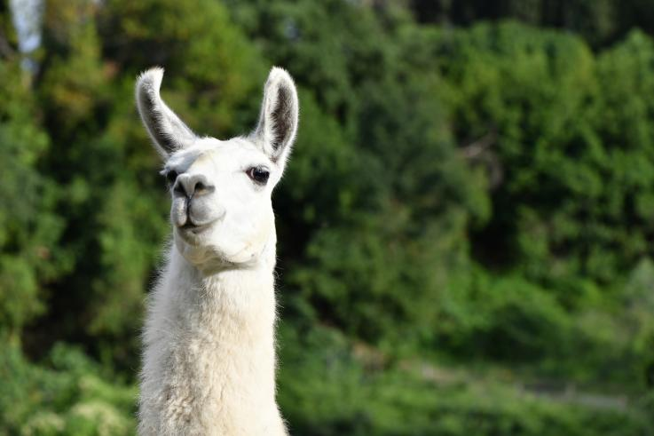

## Welcome

So, why llama you ask?
well, I'm not really sure, I think that llama is the new pineapple and pineapples are obviously cool
so this thing is actually writing itself as you can see.

---

[Tensor Networks and Probabilistic Graphical Models Duality](#tensor-networks-and-probabilistic-graphical-models-duality) 

# Tensor Networks and Probabilistic Graphical Models Duality

In the [papper](https://arxiv.org/abs/1710.01437) of Elina Robeva (MIT) and Anna Seigal (Berkeley) "*Duality of Graphical Models and Tensor Networks*", following proposition 3.7 that marginalization in graphical models and contractions in tensor networks are actually the same thing and can be discribed using the next equation

